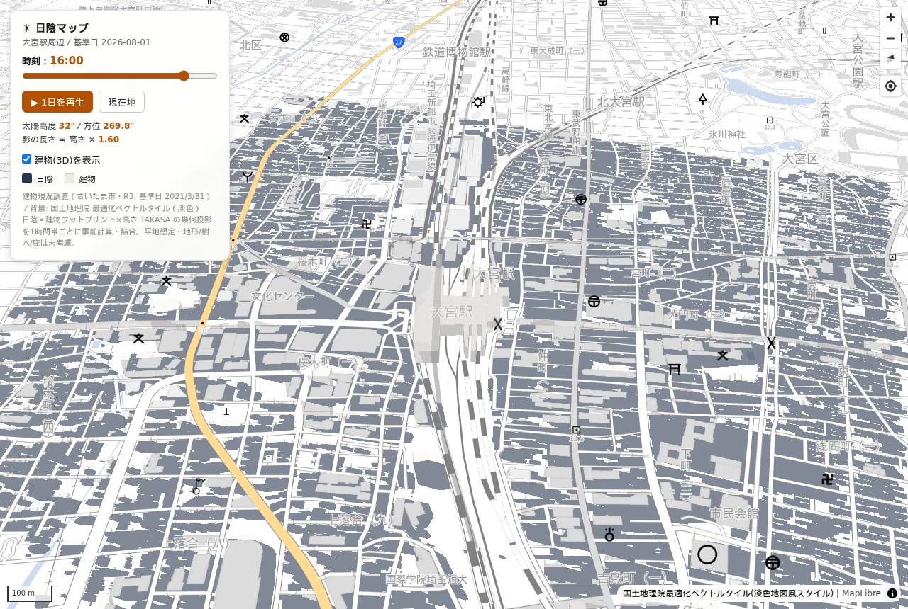

# shade-map — さいたま市 日陰マップ（大宮駅周辺）

猛暑日に「日陰を選んで歩く」ための、**時間帯別 日陰マップ**。
さいたま市の建物現況調査データ（建物フットプリント＋高さ）から、1時間ごとの日陰ポリゴンを事前計算し、
**MapLibre GL JS + deck.gl** で可視化します。時刻スライダーで時間帯を切り替えると、その時刻の日陰が表示されます。

PLATEAU の「特定の日時における日陰を閲覧する」と同じ発想を、市の独自調査データで再現したものです。



## 技術構成
- **ビルド**: Vite + TypeScript（Node.js）
- **地図**: MapLibre GL JS 4
- **日陰オーバーレイ**: deck.gl 9（`@deck.gl/mapbox` MapboxOverlay / GeoJsonLayer, interleaved）
- **建物**: PMTiles ベクトルタイル（`fill-extrusion`, source-layer `building`）
- **背景地図**: 国土地理院 最適化ベクトルタイル（淡色地図風スタイル, `public/style/pale.json`）
- トークン不要・すべて無料タイル

## 画面
- 時刻スライダー（5:00〜18:00）で日陰を切替、「▶ 1日を再生」でアニメーション
- 建物3D表示のオン/オフ、現在地（GeolocateControl）
- 太陽高度・方位・影長倍率を表示
- 日陰はラベル直下（`beforeId` で最初のシンボルレイヤーの下）に描画し、地名を隠さない

## セットアップ
```bash
npm install
npm run dev        # 開発サーバ (http://localhost:5173)
npm run build      # 型チェック + ビルド → docs/ に出力
npm run preview    # docs/ をプレビュー
```

## データ生成（再現手順）
```bash
# 1) 原データから建物PMTiles（要 tippecanoe）
npm run tiles      # data/omiya.geojson -> public/tiles/building.pmtiles

# 2) 時間帯別 日陰ポリゴンを事前計算（要 shapely, pyproj, numpy）
npm run shade      # data/omiya.geojson -> public/data/shade_by_hour.geojson
```

### ディレクトリ
```
shade-map/
├── index.html                  Vite エントリ
├── src/
│   ├── main.ts                 アプリ本体（MapLibre + deck.gl + PMTiles）
│   ├── style.css
│   └── vite-env.d.ts
├── public/
│   ├── data/shade_by_hour.geojson   時間帯別 日陰ポリゴン（基準日 2026-08-01）
│   ├── tiles/building.pmtiles       建物FP＋高さ（z13-18, 10,211棟）
│   └── style/pale.json              地理院 最適化ベクトルタイル淡色スタイル
├── scripts/
│   ├── precompute_shade.py     日陰ポリゴン事前計算（NOAA太陽位置）
│   └── build_tiles.sh          建物PMTiles生成（tippecanoe）
├── data/omiya.geojson          原データ（建物FP＋属性, EPSG:4326）
├── notes/都市計画基礎調査.md    制度・全国統計メモ
└── docs/                       ビルド成果物（GitHub Pages 公開用）
```

## 日陰の計算方法
各建物フットプリントを、太陽と反対方向へ `L = 高さ ÷ tan(太陽高度)` だけ水平移動し、
元の footprint と移動後の凸包を1棟分の日陰とみなして全棟を結合（ディゾルブ）します。
太陽位置は NOAA 太陽位置アルゴリズムで算出（JST→UTC 変換込み）。

**前提・制約**：平地想定。地形・樹木・庇・軒・空中連絡通路などは未考慮。屋根形状は矩形押し出しの近似。

## データ出典
- さいたま市 建物現況調査（市独自調査／R3都市計画基礎調査、基準日 2021-03-31）
  原データ座標系：平面直角座標系 第Ⅸ系（EPSG:6677）
- 背景：国土地理院 最適化ベクトルタイル（optimal_bvmap-v1）

## デプロイ（GitHub Pages）
`npm run build` で `docs/` に出力されます。リポジトリ設定で Pages のソースを
`main` ブランチ `/docs` にすれば公開できます（`vite.config.ts` は `base: './'`）。
